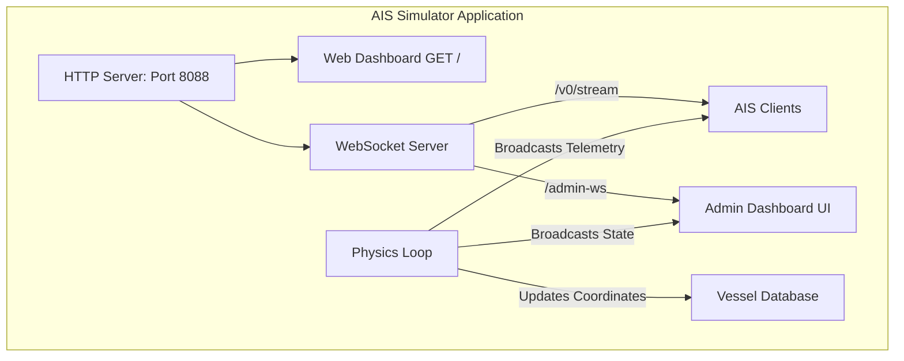
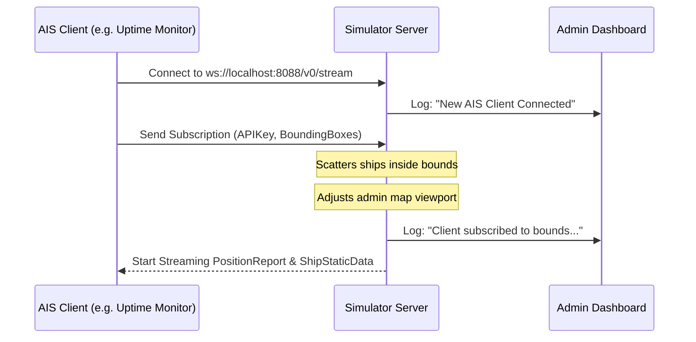

# AISStream Simulator - Architecture Documentation

This document describes the internal design, architecture, and data schemas of the **AISStream Simulator**. It serves as a guide for developers wanting to modify, deploy, or spin off the simulator into a standalone project.

---

## 1. System Overview

The AISStream Simulator is a lightweight, self-contained development tool written in Node.js. It mocks the live WebSocket feed provided by `stream.aisstream.io`, allowing offline testing of AIS clients (such as the AIS Uptime Monitor or Home Assistant integrations) without hitting API limits or causing connection lockouts.



---

## 2. Core Components

### 2.1 HTTP & WebSocket Routing
The server utilizes the native `http` module and the lightweight `ws` package. All traffic routes through a single port (`8088` by default):
- **HTTP `GET /`**: Serves the Admin Dashboard HTML, CSS, and client-side JavaScript.
- **WebSocket `/v0/stream`**: The mock AISStream endpoint. It accepts client connections, expects subscription messages containing bounding boxes, and streams coordinates.
- **WebSocket `/admin-ws`**: The private dashboard channel. It updates the frontend with real-time ship positions, active client stats, and log history, while receiving simulation actions (Pause, Drop, Inject).

### 2.2 Physics & Simulation Engine
A single server-side timer (`setInterval` ticking every 1 second) coordinates the simulation physics:
- **Drift Physics**: For each vessel, the simulator calculates latitude and longitude shifts based on Speed Over Ground (SOG) in knots and Course Over Ground (COG) in degrees.
  - \(\Delta\text{Lat} = \frac{\text{SOG} \times \cos(\text{COG}) \times \Delta t}{60 \times 3600}\)
  - \(\Delta\text{Lon} = \frac{\text{SOG} \times \sin(\text{COG}) \times \Delta t}{60 \times \cos(\text{Lat}) \times 3600}\)
- **Dynamic Bounding Box Reseeding**: When a client subscribes to a bounding box, the simulator detects if any vessels are outside it. If so, it scatters/re-seeds the vessels inside the client's coordinates and centers the admin map there.
- **Dynamic Wrap-Around**: Vessels that drift past the margins of the map wrap around to the opposite side to keep the stream populated.

---

## 3. Data Flows

### 3.1 Client Subscription Handshake


### 3.2 Error & Disconnect Simulation
- **Abrupt Disconnection (1006)**: When triggering a `1006` drop, the server calls `client.terminate()`. This destroys the TCP socket instantly without a WebSocket close frame, forcing the client's library to detect an abnormal close.
- **Graceful Disconnection (e.g. 1008/1000)**: The server calls `client.close(code, reason)` to cleanly terminate with a frame.
- **Authentication Failure**: When toggled, incoming subscriptions are rejected with a JSON payload:
  ```json
  {"Type": "Error", "Message": "Authentication failed or rejected by server"}
  ```
  followed by a socket close.

---

## 4. Message Schemas

### 4.1 Telemetry / Position Report
Broadcasted by the server every second for all vessels inside the client's subscription area.
```json
{
  "MessageType": "PositionReport",
  "MetaData": {
    "MMSI": 538008272,
    "ShipName": "MAERSK MC-KINNEY MOLLER"
  },
  "Message": {
    "PositionReport": {
      "Latitude": 1.25,
      "Longitude": 103.75,
      "Sog": 12.4,
      "Cog": 85.0,
      "TrueHeading": 85,
      "NavigationalStatus": 0
    }
  }
}
```

### 4.2 Ship Static Data Report
Broadcasted periodically (every 10 simulation ticks) to send static characteristics.
```json
{
  "MessageType": "ShipStaticData",
  "MetaData": {
    "MMSI": 538008272,
    "ShipName": "MAERSK MC-KINNEY MOLLER"
  },
  "Message": {
    "ShipStaticData": {
      "Destination": "SINGAPORE",
      "Eta": {
        "Month": 7,
        "Day": 10,
        "Hour": 12,
        "Minute": 0
      },
      "Dimension": {
        "A": 200,
        "B": 50
      },
      "ImoNumber": 9632064,
      "CallSign": "OUJD2",
      "Type": 70
    }
  }
}
```

---

## 5. Front-End Dashboard Design
The dashboard is embedded directly inside `server.js` and serves as a single-page app containing:
- **Leaflet.js Map**: Uses OpenStreetMap tiled mapping with CARTO Dark Matter tiles.
- **SVG Marker Layers**: Renders dynamic ship icons rotated according to their current `COG`. Tooltips are bound to markers showing real-time telemetry.
- **Admin Commands**: Uses WebSocket `/admin-ws` to send JSON action payloads:
  - `{ "action": "toggle_pause" }`
  - `{ "action": "toggle_empty_stream" }`
  - `{ "action": "toggle_auth_error" }`
  - `{ "action": "set_speed", "data": { "speed": 5 } }`
  - `{ "action": "disconnect_clients", "data": { "code": 1006, "reason": "Abrupt" } }`
  - `{ "action": "inject_ship", "data": { ... } }`
